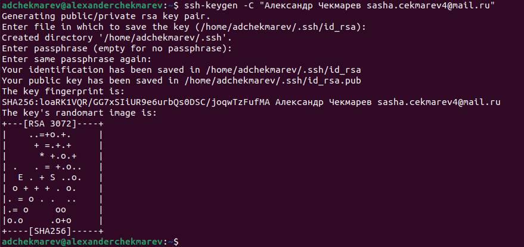
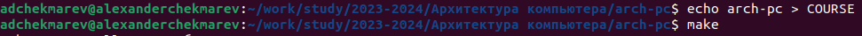

---
## Front matter
title: "Отчёт по лабораторной работе №2"
subtitle: "Система контроля версии Git"
author: "Чекмарев Александр Дмитриевич | группа: НПИбд 02-23"

## Generic otions
lang: ru-RU
toc-title: "Содержание"

## Bibliography
bibliography: bib/cite.bib
csl: pandoc/csl/gost-r-7-0-5-2008-numeric.csl

## Pdf output format
toc: true # Table of contents
toc-depth: 2
lof: true # List of figures
lot: true # List of tables
fontsize: 12pt
linestretch: 1.5
papersize: a4
documentclass: scrreprt
## I18n polyglossia
polyglossia-lang:
  name: russian
  options:
	- spelling=modern
	- babelshorthands=true
polyglossia-otherlangs:
  name: english
## I18n babel
babel-lang: russian
babel-otherlangs: english
## Fonts
mainfont: PT Serif
romanfont: PT Serif
sansfont: PT Sans
monofont: PT Mono
mainfontoptions: Ligatures=TeX
romanfontoptions: Ligatures=TeX
sansfontoptions: Ligatures=TeX,Scale=MatchLowercase
monofontoptions: Scale=MatchLowercase,Scale=0.9
## Biblatex
biblatex: true
biblio-style: "gost-numeric"
biblatexoptions:
  - parentracker=true
  - backend=biber
  - hyperref=auto
  - language=auto
  - autolang=other*
  - citestyle=gost-numeric
## Pandoc-crossref LaTeX customization
figureTitle: "Рис."
tableTitle: "Таблица"
listingTitle: "Листинг"
lofTitle: "Список иллюстраций"
lotTitle: "Список таблиц"
lolTitle: "Листинги"
## Misc options
indent: true
header-includes:
  - \usepackage{indentfirst}
  - \usepackage{float} # keep figures where there are in the text
  - \floatplacement{figure}{H} # keep figures where there are in the text
---

# Цель работы

Целью работы является изучить идеологию и применение средств контроля версий. Приобрести практические навыки по работе с системой git (синхронизация github c Linux).

# Выполнение лабораторной работы (Ход работы)
**2.1 Настройка github**

Создайте учётную запись на сайте https://github.com/ и заполните основные данные.

{width=100%}
 
У меня уже был создан профиль на github.com, так что мне нужно было просто войти в него

**2.2 Базовая настройка github**

Сначала сделаем предварительную конфигурацию git. Откроем терминал и введём следующие команды, указав имя и email своего репозитория

{width=100%}

Настроим utf-8 в выводе сообщений git

{width=100%}

Зададим имя начальной ветки (будем называть её master)

{width=100%}

Параметр autocrlf и safecrlf

{width=100%}

**2.3 Создание SSH ключа**

Для последующей идентификации пользователя на сервере репозиториев необходимо сгенерировать пару ключей (приватный и открытый)

{width=100%}

Ключи сохраняться в каталоге ~/.ssh/.
Далее необходимо загрузить сгенерированный открытый ключ. Для этого зайти на сайт http://github.org/ под своей учётной записью и перейти в меню Setting. После этого выбрать в боковом меню SSH and GPG keys и нажать кнопку New SSH key. Скопировав из локальной консоли ключ в буфер обмена

{width=100%}

{width=100%}

**2.4 Сознание рабочего пространства и репозитория курса на основе шаблона**

При выполнении лабораторной работ следует придерживаться структуры рабочего пространства. Рабочее пространство по предмету располагается в следующей иерархии:
~/work/study/ 

 ___ < учебный год>/

     └── <название предмета>/

               └── <код предмета>/

Например, для 2023–2024 учебного года и предмета «Архитектура компьютера» (код предмета arch-pc) структура каталогов примет следующий вид: 
~/work/study/
 
 ___ 2023–2024/ 

   ___ Архитектура компьютера/ 

     └── arch-pc/ 

         └── labs/ 

             └── lab01/ 

             └── lab02/ 

             └── lab03/

              ...

• Каталог для лабораторных работ имеет вид labs. 

• Каталоги для лабораторных работ имеют вид lab, например: lab01, lab02 и т.д. 
Название проекта на хостинге git имеет вид: study__ Например, для 2023–2024 учебного года и предмета «Архитектура компьютера» (код предмета arch-pc) название проекта примет следующий вид: study_2023–2024_arch-pc

{width=100%}

Откроем терминал и создадим каталог для предмета «Архитектура компьютера»

{width=100%}

**2.5 Сознание репозитория курса на основе шаблона**

Репозиторий на основе шаблона можно создать через web-интерфейс github. Перейдём на станицу репозитория с шаблоном курса https://github.com/yamadharma/course-directory-student-template. 
Далее выберем Use this template

{width=100%}

В открывшемся окне зададим имя репозитория (Repository name) study_2023–2024_arh-pc и создадим репозиторий (кнопка Create repository from template)

{width=100%}
Откроем терминал и перейдём в каталог курса:

{width=100%}

Создадим каталог arсh-pc:

{width=100%}

Ссылку для клонирования можно скопировать на странице созданного репозитория Code -> SSH:

{width=100%}

Клонируем созданный репозиторий в arсh-pc:

{width=100%}

**2.6 Настройка каталога курса**

Перейдём в каталог курса:

{width=100%}

Удалим лишние файлы:

{width=100%}

Создадим необходимые каталоги:

{width=100%}

Отправим файлы на сервер:

{width=100%}

{width=100%}

Проверим правильность создания иерархии рабочего пространства в локальном репозитории и на странице github:

{width=100%}

# Самостоятельная работа

**Задание№1 Создайте отчет по выполнению лабораторной работы в соответствующем каталоге рабочего пространства (labs > lab02 > report).**

Создадим отчет по выполнению лабораторной работы в Домашней папке:

{width=100%}

Копируем нужный нам файл из Домашней папки в каталог рабочего пространства /lab02/report:

{width=100%}

**Задание№2 Скопируйте отчеты по выполнению предыдущих лабораторных 
работ в соответствующие каталоги созданного рабочего пространства**

Скопируем отчет по первой лабораторной работе в каталог /lab01/report:

{width=100%}

{width=100%}

Проверим правильность выполненных действий:

{width=100%}

**Задание№3 Загрузите файлы на github.**

Используем известные мне команды в терминале для загрузки файлов на github:

{width=100%}

Проверим правильность выполненных действий:

{width=100%}

{width=100%}

# Вывод

В ходе выполнения лабораторной работы были изучены идеологии и
применение средств контроля версий. Также были приобретены практические навыки по работе с системой git.

