---
## Front matter
title: "Лабораторная работа №4"
subtitle: "Создание и процесс
обработки программ на языке ассемблера NASM"
author: "Чекмарев Александр Дмитриевич | группа: НПИбд 02-23"

## Generic otions
lang: ru-RU
toc-title: "Содержание"

## Bibliography
bibliography: bib/cite.bib
csl: pandoc/csl/gost-r-7-0-5-2008-numeric.csl

## Pdf output format
toc: true # Table of contents
toc-depth: 2
lof: true # List of figures
lot: true # List of tables
fontsize: 12pt
linestretch: 1.5
papersize: a4
documentclass: scrreprt
## I18n polyglossia
polyglossia-lang:
  name: russian
  options:
	- spelling=modern
	- babelshorthands=true
polyglossia-otherlangs:
  name: english
## I18n babel
babel-lang: russian
babel-otherlangs: english
## Fonts
mainfont: PT Serif
romanfont: PT Serif
sansfont: PT Sans
monofont: PT Mono
mainfontoptions: Ligatures=TeX
romanfontoptions: Ligatures=TeX
sansfontoptions: Ligatures=TeX,Scale=MatchLowercase
monofontoptions: Scale=MatchLowercase,Scale=0.9
## Biblatex
biblatex: true
biblio-style: "gost-numeric"
biblatexoptions:
  - parentracker=true
  - backend=biber
  - hyperref=auto
  - language=auto
  - autolang=other*
  - citestyle=gost-numeric
## Pandoc-crossref LaTeX customization
figureTitle: "Рис."
tableTitle: "Таблица"
listingTitle: "Листинг"
lofTitle: "Список иллюстраций"
lotTitle: "Список таблиц"
lolTitle: "Листинги"
## Misc options
indent: true
header-includes:
  - \usepackage{indentfirst}
  - \usepackage{float} # keep figures where there are in the text
  - \floatplacement{figure}{H} # keep figures where there are in the text
---

# Цель работы

Освоение процедуры компиляции и сборки программ, написанных на ассемблере NASM.

# Выполнение лабораторной работы

**2.1 Программа Hello world!**

Рассмотрим пример простой программы на языке ассемблера NASM. Традиционно первая программа выводит приветственное сообщение Hello world! на экран.
Создадим каталог для работы с программами на языке ассемблера NASM:

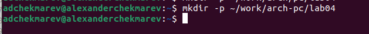{#fig:001 width=70%}

Перейдём в созданный каталог

Создадим текстовый файл с именем **hello.asm**

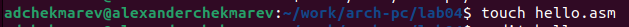

Откроем этот файл с помощью любого текстового редактора, например, gedit

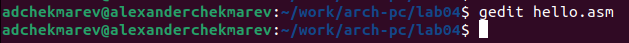

Введём в нём следующий текст:

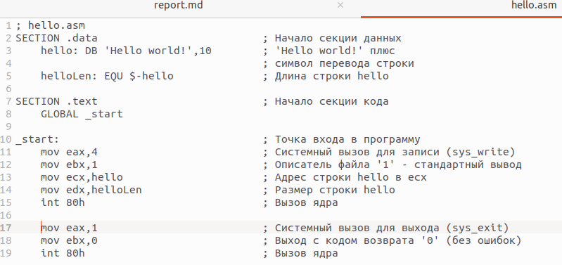

В отличие от многих современных высокоуровневых языков программирования, в ассемблерной программе каждая команда располагается на **отдельной строке**. Размещение нескольких команд на одной строке **недопустимо**. Синтаксис ассемблера NASM является **чувствительным к регистру**, т.е. есть разница между большими и малыми буквами.

**2.2 Транслятор NASM**

NASM превращает текст программы в объектный код. Например, для компиляции приведённого выше текста программы «Hello World» необходимо написать:

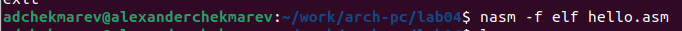

Если текст программы набран без ошибок, то транслятор преобразует текст программы из файла **hello.asm** в объектный код, который запишется в файл **hello.o**. Таким образом, имена всех файлов получаются из имени входного файла и расширения по умолчанию. При наличии ошибок объектный файл не создаётся, а после запуска транслятора появятся сообщения об ошибках или предупреждения.

С помощью команды *ls* проверим, что объектный файл был создан:

NASM не запускают без параметров. Ключ *-f* указывает транслятору, что требуется создать бинарные файлы в формате **ELF**. Следует отметить, что формат **elf64** позволяет создавать исполняемый код, работающий под 64-битными версиями Linux. Для 32-битных версий ОС указываем в качестве формата просто **elf**. NASM всегда создаёт выходные файлы в **текущем** каталоге.

**2.3 Расширенный синтаксис командной строки NASM**

Полный вариант командной строки nasm выглядит следующим образом:

nasm [-@ косвенный_файл_настроек] [-o объектный_файл] [-f формат_объектного_файла] [-l листинг] [параметры...] [--] исходный_файл

Выполним следующую команду:

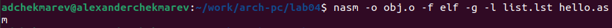

Данная команда скомпилирует исходный файл **hello.asm** в **obj.o** (опция *-o* позволяет задать имя объектного файла, в данном случае obj.o), при этом формат выходного файла будет **elf**, и в него будут включены символы для отладки (опция *-g*), кроме того, будет создан файл листинга **list.lst** (опция *-l*).

С помощью команды *ls* проверим, что файлы были созданы:

Для более подробной информации см. *man nasm*. Для получения списка форматов объектного файла см. *nasm -hf*.

**2.4 Компоновщик LD**

Чтобы получить исполняемую программу, объектный файл необходимо передать на обработку компоновщику:

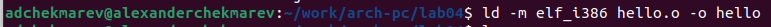

С помощью команды *ls* проверим, что исполняемый файл hello был создан:

Компоновщик ld не предполагает по умолчанию расширений для файлов, но принято использовать следующие расширения:

• o – для объектных файлов;

• без расширения – для исполняемых файлов;

• map – для файлов схемы программы;

• lib – для библиотек.

Ключ *-o* с последующим значением задаёт в данном случае имя создаваемого исполняемого файла.

Выполним следующую команду:

Объектный файл obj.o был передан на обработку компоновщику для создания исполняемого файла main.

Формат командной строки LD можно увидеть, набрав *ld --help.* Для получения более подробной информации см. *man ld*.

**2.5 Запуск исполняемого файла**

Запустить на выполнение созданный исполняемый файл, находящийся в текущем каталоге, можно, набрав в командной строке:

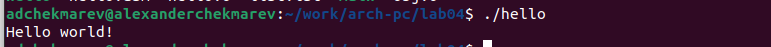

# Самостоятельна работа

*Задание№1*
*В каталоге ~/work/arch-pc/lab04 с помощью команды cp создайте копию файла hello.asm с именем lab4.asm*

Создадим копию файла hello.asm с именем lab4.asmd

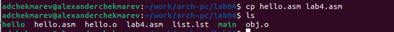
 
*Задание№2*
*С помощью любого текстового редактора внесите изменения в текст программы в файле lab4.asm так, чтобы вместо Hello world! на экран выводилась строка с вашими фамилией и именем.*

С помощью редактора markdown внесём изменения в текст в файле lab4.asm

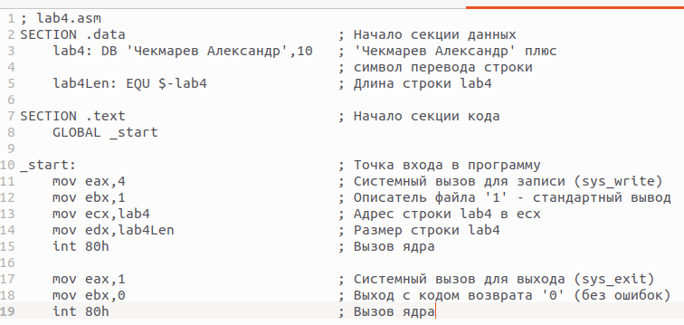

*Задание№3*
*Оттранслируйте полученный текст программы lab4.asm в объектный файл. Выполните компоновку объектного файла и запустите получившийся исполняемый файл.*

Скомпилируем файл lab4.asm

Передадим объектный файл lab4.o на обработку компоновщику

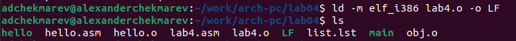

Запустим получившийся исполняемый файл LF
 
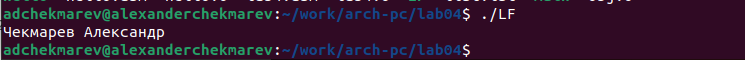

*Задание№4*
*Скопируйте файлы hello.asm и lab4.asm в Ваш локальный репозиторий в каталог ~/work/study2023-2024/"Архитектура компьютера"/arch-pc/labs/lab04/.*
*Загрузите файлы на Github.*

Скопируем файлы в локальный репозиторий

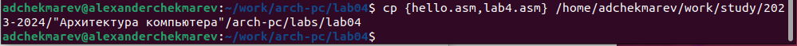

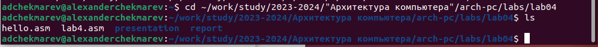

Загрузим файлы на Github

# Выводы

Я освоил процедуры компиляции и сборки программ, написанных на ассемблере NASM.

