---
## Front matter
title: "Лабораторная работа №6"
subtitle: "Арифметические операции в NASM"
author: "Чекмарев Александр Дмитриевич | группа: НПИбд 02-23"

## Generic otions
lang: ru-RU
toc-title: "Содержание"

## Bibliography
bibliography: bib/cite.bib
csl: pandoc/csl/gost-r-7-0-5-2008-numeric.csl

## Pdf output format
toc: true # Table of contents
toc-depth: 2
lof: true # List of figures
lot: true # List of tables
fontsize: 12pt
linestretch: 1.5
papersize: a4
documentclass: scrreprt
## I18n polyglossia
polyglossia-lang:
  name: russian
  options:
	- spelling=modern
	- babelshorthands=true
polyglossia-otherlangs:
  name: english
## I18n babel
babel-lang: russian
babel-otherlangs: english
## Fonts
mainfont: PT Serif
romanfont: PT Serif
sansfont: PT Sans
monofont: PT Mono
mainfontoptions: Ligatures=TeX
romanfontoptions: Ligatures=TeX
sansfontoptions: Ligatures=TeX,Scale=MatchLowercase
monofontoptions: Scale=MatchLowercase,Scale=0.9
## Biblatex
biblatex: true
biblio-style: "gost-numeric"
biblatexoptions:
  - parentracker=true
  - backend=biber
  - hyperref=auto
  - language=auto
  - autolang=other*
  - citestyle=gost-numeric
## Pandoc-crossref LaTeX customization
figureTitle: "Рис."
tableTitle: "Таблица"
listingTitle: "Листинг"
lofTitle: "Список иллюстраций"
lotTitle: "Список таблиц"
lolTitle: "Листинги"
## Misc options
indent: true
header-includes:
  - \usepackage{indentfirst}
  - \usepackage{float} # keep figures where there are in the text
  - \floatplacement{figure}{H} # keep figures where there are in the text
---

# Цель работы

Освоение арифметических инструкций языка ассемблера NASM.

# Выполнение лабораторной работы

## Символьные и численные данные в NASM

Создадим каталог для программ лабораторной работы № 6, перейдем в него и создадим файл *lab6-1.asm*:

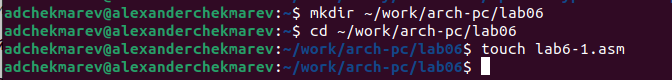

Рассмотрим примеры программ вывода символьных и численных значений. Программы будут выводить значения записанные в регистр eax.
 
Введем в файлe *lab6-1.asm* текст программы из листинга 6.1. В данной программе в регистр eax записывается символ 6 (mov eax,'6'), в регистр ebx символ 4 (mov ebx,'4'). Далее к значению в регистре eax прибавляем значение регистра ebx (add eax,ebx, результат сложения запишется в регистр eax). Далее выводим результат. Так как для работы функции *sprintLF* в регистр eax должен быть записан адрес, необходимо использовать дополнительную переменную. Для этого запишем значение регистра eax в переменную *buf1 (mov [buf1],eax)*, а затем запишем адрес переменной *buf1* в регистр *eax (mov eax,buf1)* и вызовем функцию sprintLF.

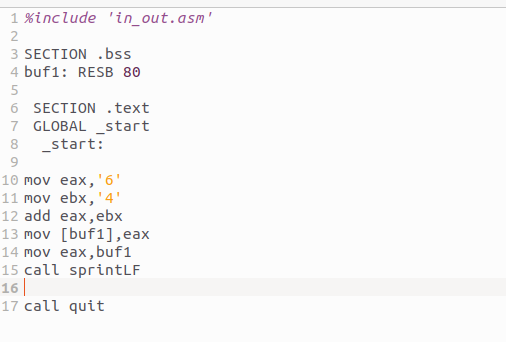

Скопируем *in_out.asm* из каталога *lab05* в *lab06*

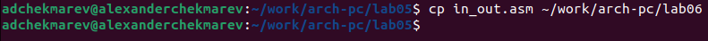

Создадим исполняемый файл и запустим его

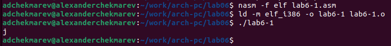

В данном случае при выводе значения регистра eax мы ожидаем увидеть число 10. Однако результатом будет символ j. Это происходит потому, что код символа 6 равен 00110110 в двоичном представлении (или 54 в десятичном представлении), а код символа 4 – 00110100 (52). Команда add eax,ebx запишет в регистр eax сумму кодов – 01101010 (106), что в свою очередь является кодом символа j (см. таблицу ASCII в приложении).

Далее изменим текст программы и вместо символов, запишем в регистры числа. Исправим текст программы следующим образом:

* mov eax,'6'
* mov ebx,'4'

на строки

* mov eax,6
* mov ebx,4

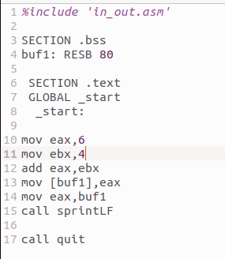

Cоздадим исполняемый файл и запустим его.

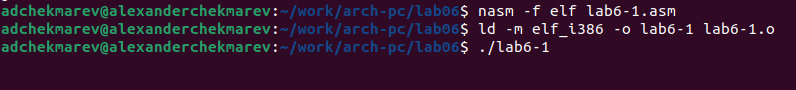

Как и в предыдущем случае при исполнении программы мы не получим число 10. В данном случае выводится символ с кодом 10. Пользуясь таблицей ASCII определим какому символу соответствует код 10, это *LF, |n*. Который не отображается на выводе
Как отмечалось выше, для работы с числами в файле in_out.asm реализованы подпрограммы для преобразования ASCII символов в числа и обратно. Преобразуем текст программы из Листинга 6.1 с использованием этих функций.

Создадим файл *lab6-2.asm* в каталоге *~/work/arch-pc/lab06* и введем в него текст программы из листинга 6.2.

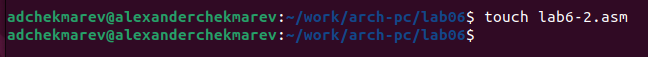

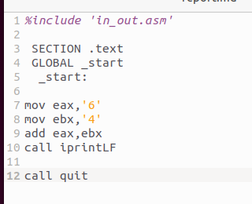

Создадим исполняемый файл и запустим его.

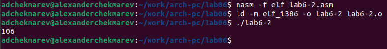

В результате работы программы мы получим число 106. В данном случае, как и в первом, команда add складывает коды символов '6' и '4' (54+52=106). Однако, в отличии от программы из листинга 6.1, функция *iprintLF* позволяет вывести число, а не символ, кодом которого является это число.

Аналогично предыдущему примеру изменим символы на числа. Заменим строки

* mov eax,'6'
* mov ebx,'4'

на строки

* mov eax,6
* mov ebx,4

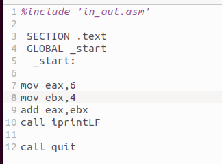

Создадим исполняемый файл и запустим его. 

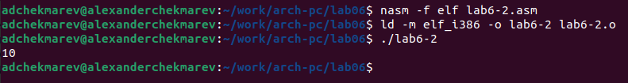

В результате мы получили число 10

Заменим функцию *iprintLF* на *iprint*. Создадим исполняемый файл и запустим его.

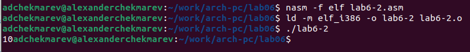

В результате также мы получили число 10, но в случае *iprint* число выведено без красной строки

## Выполнение арифметических операций в NASM

В качестве примера выполнения арифметических операций в NASM приведем программу вычисления арифметического выражения f(x)= (5 * 2 + 3)/3.

Создадим файл *lab6-3.asm* в каталоге ~/work/arch-pc/lab06:

Внимательно изучим текст программы из листинга 6.3 и введем в *lab6-3.asm*.

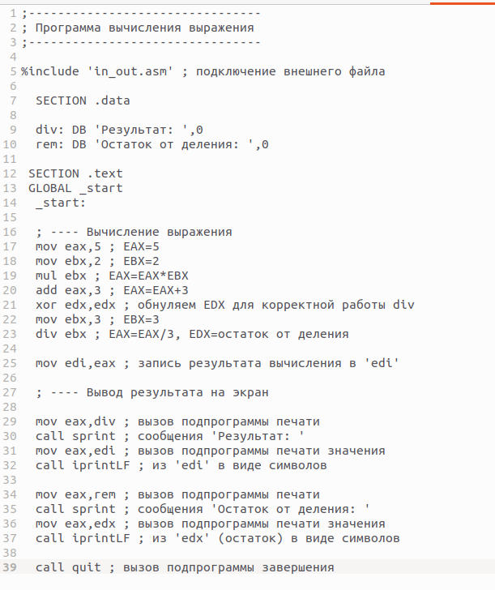

Создадим исполняемый файл и запустим его.

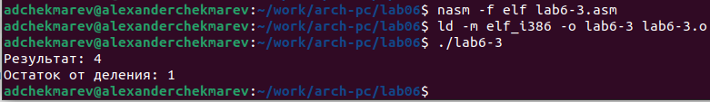

Изменим текст программы для вычисления выражения f(x) = (4 * 6 + 2)/5. 

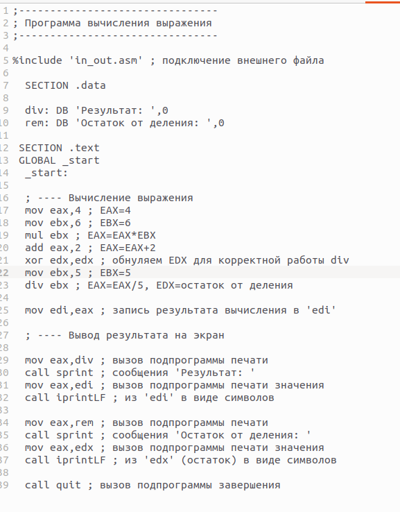

Создадим исполняемый файл и проверим его работу.

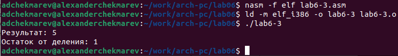

В качестве другого примера рассмотрим программу вычисления варианта задания по номеру студенческого билета, работающую по следующему алгоритму:

* вывести запрос на введение № студенческого билета
* вычислить номер варианта по формуле: (Sn mod 20) + 1, где Sn – номер студенческого билета (В данном случае a mod b - это остаток от деления a на b).
* вывести на экран номер варианта.

В данном случае число, над которым необходимо проводить арифметические операции, вводится с клавиатуры. Как отмечалось выше ввод с клавиатуры осуществляется в символьном виде и для корректной работы арифметических операций в NASM символы необходимо преобразовать в числа. Для этого может быть использована функция atoi из файла in_out.asm.

Создадим файл *variant.asm* в каталоге ~/work/arch-pc/lab06:

Внимательно изучим текст программы из листинга 6.4 и введем в файл variant.asm.

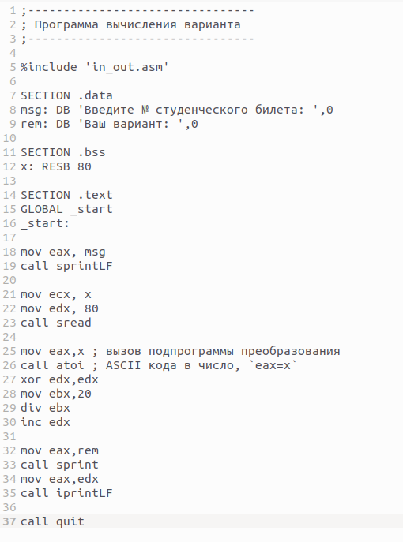

Создадим исполняемый файл и запустим его.

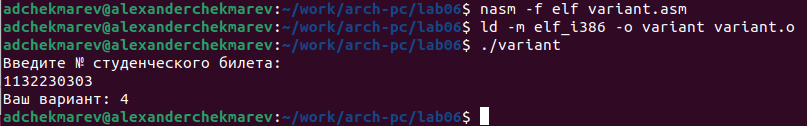
 
 
## Вопросы

Включите в отчет по выполнению лабораторной работы ответы на следующие вопросы:

1) Какие строки листинга 6.4 отвечают за вывод на экран сообщения ‘Ваш вариант:’?

* mov eax,rem
* call sprint

2) Для чего используется следующие инструкции?

* mov ecx, x - перемещает адрес вводимой строки в ecx
* mov edx, 80 - записывает длину строки в регистр edx
* call sread- вызывает подпрограммы, которые обеспечивают ввод сообщения с помощью клавиатуры

3) Для чего используется инструкция “call atoi”?

Она используется для вызыва подпрограммы, которая преобразует ASII код символа в целое число, записывая его в результат регитсра eax

4) Какие строки листинга 6.4 отвечают за вычисления варианта?

* xor edx, edx ; обнуление ebx для div
* mov ebx, 10  ; ebx=10
* div ebx ; eax = eax/10, edx - остаток от деления
* inc edc ; edx=edx+1

5) В какой регистр записывается остаток от деления при выполнении инструкции “div
ebx”?

При div ebx остаток от деления записывается в edx 

6) Для чего используется инструкция “inc edx”?

inc edx увелиивает значение регистра edx на +1

7) Какие строки листинга 6.4 отвечают за вывод на экран результата вычислений?

* mov eax, edx
* call iprintLF

# Самостоятельная работа

***Задание№1 Написать программу вычисления выражения y=f(x). Программа должна выводить выражение для вычисления, выводить запрос на ввод значения x, вычислять заданное выражение в зависимости от введенного x, выводить результат вычислений. Вид функции f(x) выбрать из таблицы 6.3 вариантов заданий в соответствии с номером полученным при выполнении лабораторной работы. Создайте исполняемый файл и проверьте его работу для значений x1 и x2 из 6.3.***
***При выполнении задания преобразовывать (упрощать) выражения для f(x) нельзя. При выполнении деления в качестве результата можно использовать только целую часть от деления и не учитывать остаток (т.е. 5 : 2 = 2)***

Создадим новый файл для задания и напишем программу для f(x)=4/3*(x-1)+5

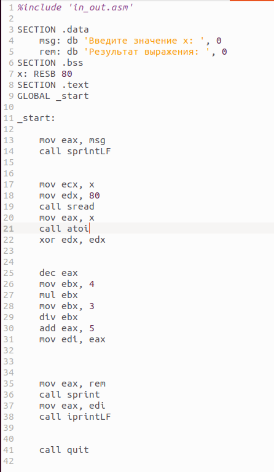

Проверим программу

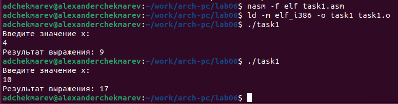

Загрузим все файлы на github по окончании лаб. работы
 
# Выводы

Я освоил арифметические инструкции языка ассемблера NASM и приобрел практические навыки по работе с арифметикой в NASM.

