---
## Front matter
title: "Лабораторная работа №7"
subtitle: "Команды безусловного и условного переходов в Nasm. Программирование ветвлений."
author: "Чекмарев Александр Дмитриевич | группа: НПИбд 02-23"

## Generic otions
lang: ru-RU
toc-title: "Содержание"

## Bibliography
bibliography: bib/cite.bib
csl: pandoc/csl/gost-r-7-0-5-2008-numeric.csl

## Pdf output format
toc: true # Table of contents
toc-depth: 2
lof: true # List of figures
lot: true # List of tables
fontsize: 12pt
linestretch: 1.5
papersize: a4
documentclass: scrreprt
## I18n polyglossia
polyglossia-lang:
  name: russian
  options:
	- spelling=modern
	- babelshorthands=true
polyglossia-otherlangs:
  name: english
## I18n babel
babel-lang: russian
babel-otherlangs: english
## Fonts
mainfont: PT Serif
romanfont: PT Serif
sansfont: PT Sans
monofont: PT Mono
mainfontoptions: Ligatures=TeX
romanfontoptions: Ligatures=TeX
sansfontoptions: Ligatures=TeX,Scale=MatchLowercase
monofontoptions: Scale=MatchLowercase,Scale=0.9
## Biblatex
biblatex: true
biblio-style: "gost-numeric"
biblatexoptions:
  - parentracker=true
  - backend=biber
  - hyperref=auto
  - language=auto
  - autolang=other*
  - citestyle=gost-numeric
## Pandoc-crossref LaTeX customization
figureTitle: "Рис."
tableTitle: "Таблица"
listingTitle: "Листинг"
lofTitle: "Список иллюстраций"
lotTitle: "Список таблиц"
lolTitle: "Листинги"
## Misc options
indent: true
header-includes:
  - \usepackage{indentfirst}
  - \usepackage{float} # keep figures where there are in the text
  - \floatplacement{figure}{H} # keep figures where there are in the text
---

# Цель работы

Изучение команд условного и безусловного переходов. Приобретение навыков написания программ с использованием переходов. Знакомство с назначением и структурой файла листинга.

# Выполнение лабораторной работы

## Реализация переходов в NASM

Создадим каталог для программам лабораторной работы № 7, перейдите в него и создадим файл *lab7-1.asm*:

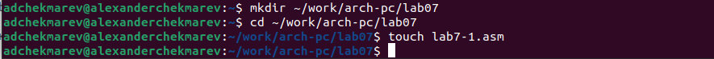

Инструкция *jmp* в NASM используется для реализации безусловных переходов. Рассмотрим пример программы с использованием инструкции *jmp*. Введем в файл *lab7-1.asm* текст программы из листинга 7.1

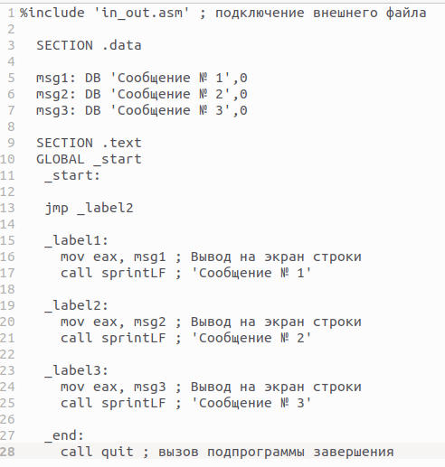

Создим исполняемый файл и запустим его. Результат работы данной программы будет следующим:

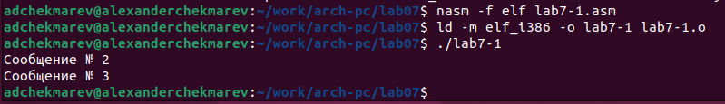

Таким образом, использование инструкции *jmp _label2* меняет порядок исполнения инструкций и позволяет выполнить инструкции начиная с метки *_label2*, пропустив вывод первого сообщения.

Инструкция *jmp* позволяет осуществлять переходы не только вперед но и назад. Изменим программу таким образом, чтобы она выводила сначала ‘Сообщение № 2’, потом ‘Сообщение № 1’ и завершала работу. Для этого в текст программы после вывода сообщения № 2 добавим инструкцию *jmp* с меткой *_label1* (т.е. переход к инструкциям вывода сообщения № 1) и после вывода сообщения № 1 добавим инструкцию *jmp* с меткой *_end* (т.е. переход к инструкции *call quit*). Измените текст программы в соответствии с листингом 7.2

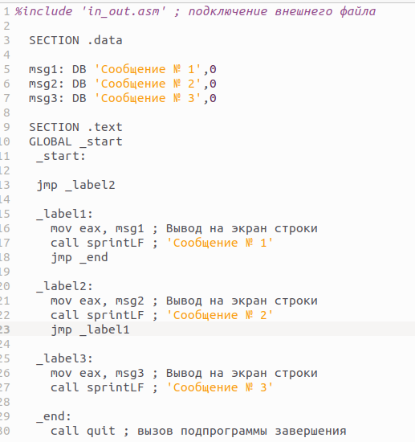

Создадим исполняемый файл и проверим его работу.

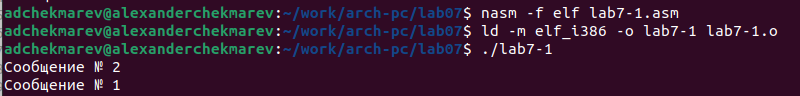

Изменим текст программы добавив или изменив инструкции *jmp*.

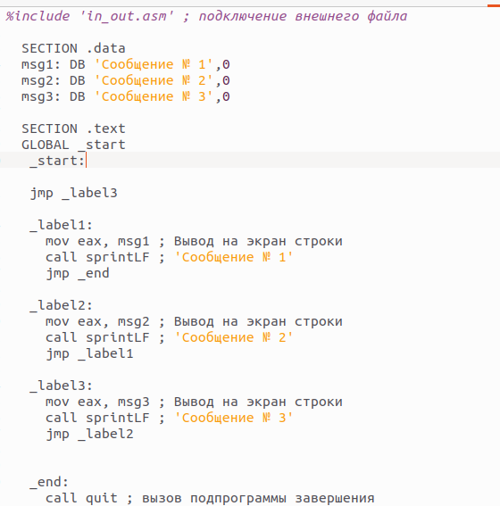

Проверим работу

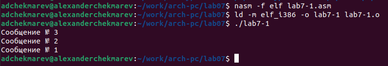

Использование инструкции *jmp* приводит к переходу в любом случае. Однако, часто при написании программ необходимо использовать условные переходы, т.е. переход должен происходить если выполнено какое-либо условие. В качестве примера рассмотрим программу, которая определяет и выводит на экран наибольшую из 3 целочисленных переменных: A,B и C. Значения для A и C задаются в программе, значение B вводиться с клавиатуры

Создадим файл *lab7-2.asm* в каталоге ~/work/arch-pc/lab07. 

Внимательно изучим текст программы из листинга 7.3 и введем в *lab7-2.asm*.

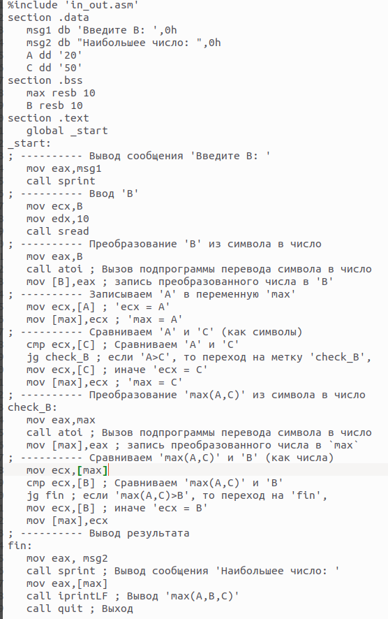

Создадим исполняемый файл и проверим его работу для разных значений B.

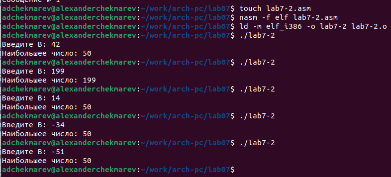

Обратим внимание, в данном примере переменные A и С сравниваются как символы, а переменная B и максимум из A и С как числа (для этого используется функция *atoi* преобразования символа в число). Это сделано для демонстрации того, как сравниваются данные. Данную программу можно упростить и сравнивать все 3 переменные как символы (т.е. не использовать функцию *atoi*). Однако если переменные преобразовать из символов числа, над ними можно корректно проводить арифметические операции.

## Изучение структуры файлы листинга

Обычно nasm создаёт в результате ассемблирования только объектный файл. Получить файл листинга можно, указав ключ -l и задав имя файла листинга в командной строке.
Создадим файл листинга для программы из файла lab7-2.asm

Откроем файл листинга lab7-2.lst с помощью любого текстового редактора, например
mcedit:

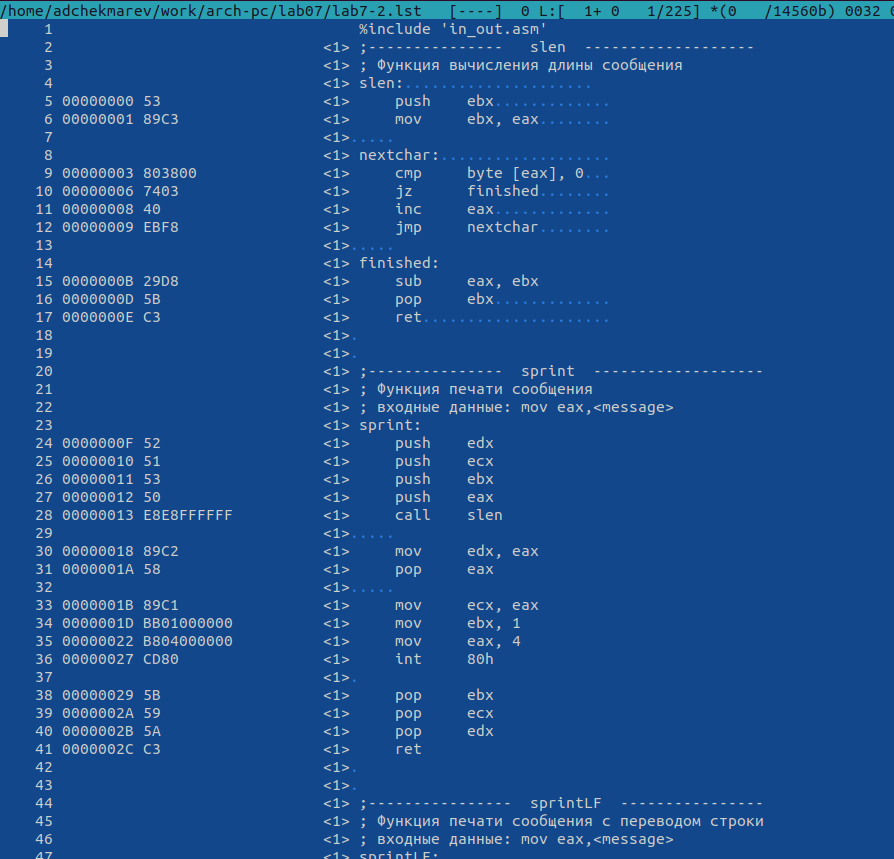

Внимательно ознакомимся с его форматом и содержимым. 
**Подробно объяснить содержимое трёх строк файла листинга по выбору.**

Возьмем первые 3 строки файла листинга, начиная с 3-ьей*

* 3 - номер строки кода, "; Функция вычисления длинны сообщения" - оно не имеет отношения к работе кода, это пояснение.
* 4 - номер строки кода, "slen:......." - название функции, не имеет адреса и машинного кода.
* 5 - номер строки кода, "00000000" - адрес строки, "53" - машинный код, "push ebx" - исходный текст программы, инструкция "push" помещает операнд "ebx" в стек.

Откроем файл с программой *lab7-2.asm* и в любой инструкции с двумя операндами удалим один операнд. Выполним трансляцию с получением файла листинга:

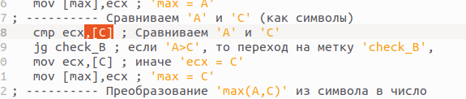

**Какие выходные файлы создаются в этом случае? Что добавляется в листинге?**

Выполним трансляцию с измененной программой

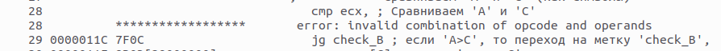

На выходе мы не получаем файла из-за ошибки. **mov** не может работать, имея только один
операнд, из-за чего нарушается работа кода
 
# Самостоятельная работа

***Задание№1 Напишите программу нахождения наименьшей из 3 целочисленных переменных a,b и c. Значения переменных выбрать из табл. 7.5 в соответствии с вариантом, полученным при выполнении лабораторной работы № 7. Создайте исполняемый файл и проверьте его работу.***

Создадим новый файл *task1.asm* и напишем программу нахождения наименьшей из 3 целочисленных переменных a,b и с для варианта 4 (8,88,68).
 

Возьмем за основу код из lab7-2.asm и переделаем его

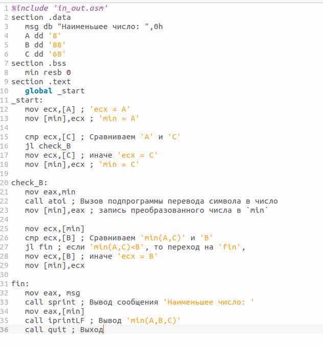

Проверим программу

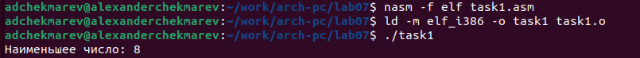

Программа работает как нужно для задания.

***Задание№2 Напишите программу, которая для введенных с клавиатуры значений x и a вычисляет значение заданной функции f(x) и выводит результат вычислений. Вид функции f(x) выбрать из таблицы 7.6 вариантов заданий в соответствии с вариантом, полученным при выполнении лабораторной работы № 7. Создайте исполняемый файл и проверьте его работу для значений x и a из 7.6***

Создадим файл *task2.asm* для 2-го задания

Напишем код к решению 4-го варианта

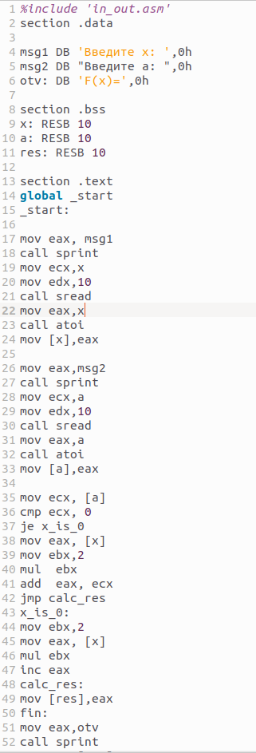

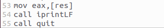

Проверим работу программы

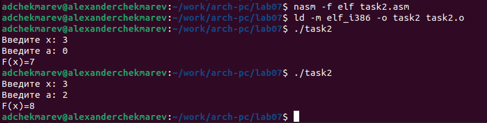

Как видно по (рис 3.2.5) программа работает корректно и я выполнил задание

Загрузим все файлы на github по окончании лаб. работы

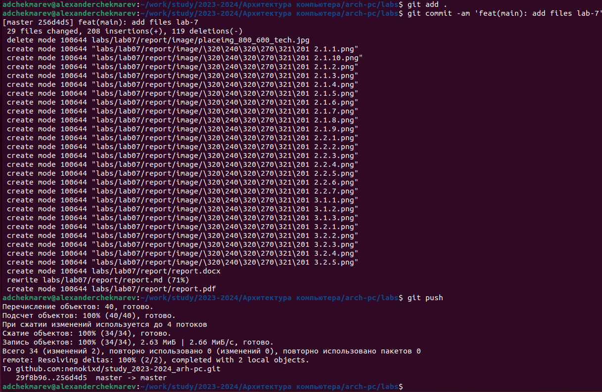

# Выводы

Я изучил команды условного и безусловного переходов. Приобрел навыки написания программ с использованием переходов. Познакомился с назначением и структурой файла листинга.

