---
## Front matter
title: "Лабораторная работа №8"
subtitle: "Программирование цикла. Обработка аргументов командной строки."
author: "Чекмарев Александр Дмитриевич | группа: НПИбд 02-23"

## Generic otions
lang: ru-RU
toc-title: "Содержание"

## Bibliography
bibliography: bib/cite.bib
csl: pandoc/csl/gost-r-7-0-5-2008-numeric.csl

## Pdf output format
toc: true # Table of contents
toc-depth: 2
lof: true # List of figures
lot: true # List of tables
fontsize: 12pt
linestretch: 1.5
papersize: a4
documentclass: scrreprt
## I18n polyglossia
polyglossia-lang:
  name: russian
  options:
	- spelling=modern
	- babelshorthands=true
polyglossia-otherlangs:
  name: english
## I18n babel
babel-lang: russian
babel-otherlangs: english
## Fonts
mainfont: PT Serif
romanfont: PT Serif
sansfont: PT Sans
monofont: PT Mono
mainfontoptions: Ligatures=TeX
romanfontoptions: Ligatures=TeX
sansfontoptions: Ligatures=TeX,Scale=MatchLowercase
monofontoptions: Scale=MatchLowercase,Scale=0.9
## Biblatex
biblatex: true
biblio-style: "gost-numeric"
biblatexoptions:
  - parentracker=true
  - backend=biber
  - hyperref=auto
  - language=auto
  - autolang=other*
  - citestyle=gost-numeric
## Pandoc-crossref LaTeX customization
figureTitle: "Рис."
tableTitle: "Таблица"
listingTitle: "Листинг"
lofTitle: "Список иллюстраций"
lotTitle: "Список таблиц"
lolTitle: "Листинги"
## Misc options
indent: true
header-includes:
  - \usepackage{indentfirst}
  - \usepackage{float} # keep figures where there are in the text
  - \floatplacement{figure}{H} # keep figures where there are in the text
---

# Цель работы

Приобретение навыков написания программ с использованием циклов и обработкой аргументов командной строки.

# Выполнение лабораторной работы

## Реализация циклов в NASM

Создадим каталог для программам лабораторной работы № 8, перейдем в него и создадим файл *lab8-1.asm*:

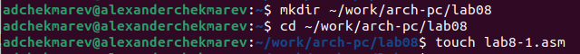

При реализации циклов в NASM с использованием инструкции loop необходимо помнить о том, что эта инструкция использует регистр *ecx* в качестве счетчика и на каждом шаге уменьшает его значение на единицу. В качестве примера рассмотрим программу, которая выводит значение регистра ecx. Внимательно изучим текст программы (Листинг 8.1).

Введем в файл *lab8-1.asm* текст программы из листинга 8.1.

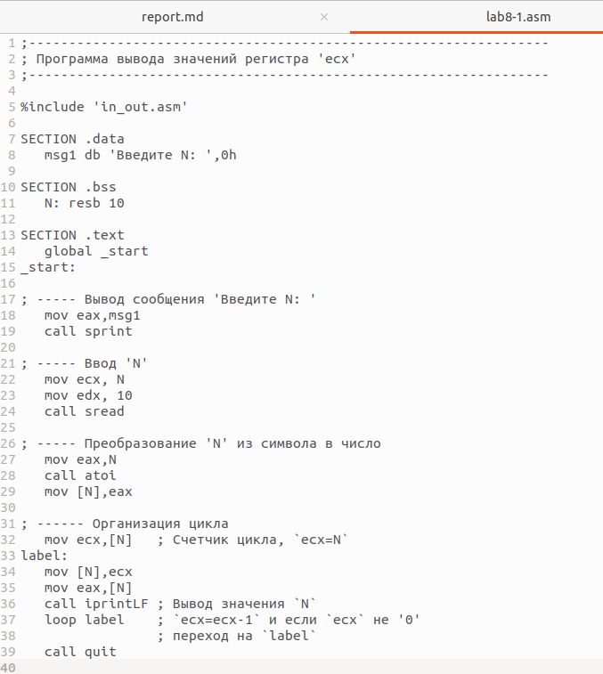

Создадим исполняемый файл и запустим его. Результат работы данной программы будет следующим:

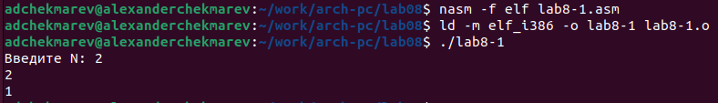

Данный пример показывает, что использование регистра ecx в теле цилка *loop* может привести к некорректной работе программы. 

Изменим текст программы добавив изменение значение регистра ecx в цикле:

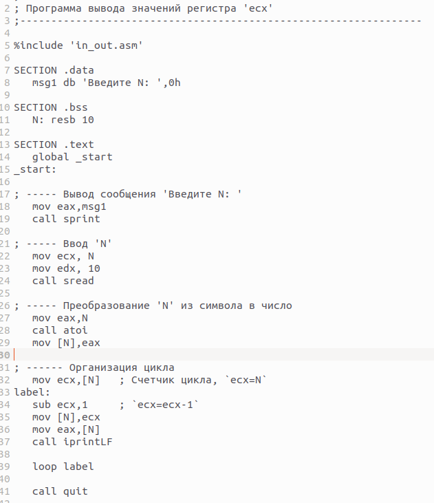

Создадим исполняемый файл и проверим его работу.

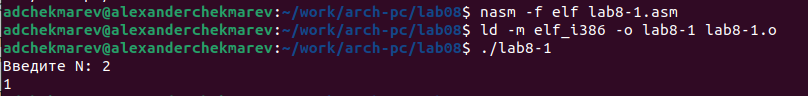

**Какие значения принимает регистр ecx в цикле? Соответствует ли число проходов цикла значению N введенному с клавиатуры?**

Если ввести 2, то подсчет будет до 1, что не соответсвует. Если к примеру ввести 5, то это явно число проходов цикла НЕ будет соответствовать введенному с клавиатуры значению

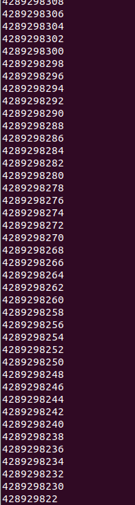

Для использования регистра *ecx* в цикле и сохранения корректности работы программы можно использовать стек. Внесем изменения в текст программы добавив команды *push* и *pop* (добавления в стек и извлечения из стека) для сохранения значения счетчика цикла *loop*:

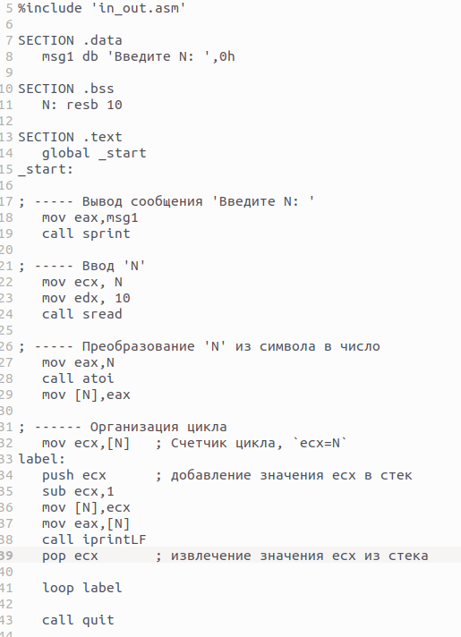

Создадим исполняемый файл и проверим его работу.

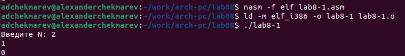

**Соответствует ли в данном случае число проходов цикла значению N введенному с клавиатуры?**

Число проходов цикла будет соответствовать введенному значению с клавиатуры (1-(2), 0-(1))

## Обработка аргументов командной строки

При разработке программ иногда встает необходимость указывать аргументы, которые будут использоваться в программе, непосредственно из командной строки при запуске программы.

При запуске программы в NASM аргументы командной строки загружаются в стек в обратном порядке, кроме того в стек записывается имя программы и общее количество аргументов. Последние два элемента стека для программы, скомпилированной NASM, – это всегда имя программы и количество переданных аргументов.

Таким образом, для того чтобы использовать аргументы в программе, их просто нужно извлечь из стека. Обработку аргументов нужно проводить в цикле. Т.е. сначала нужно извлечь из стека количество аргументов, а затем циклично для каждого аргумента выполнить логику программы. В качестве примера рассмотрим программу, которая выводит на экран аргументы командной строки. Внимательно изучим текст программы (Листинг 8.2)

Создадим файл *lab8-2.asm* в каталоге ~/work/arch-pc/lab08 и введем в него текст программы из листинга 8.2.

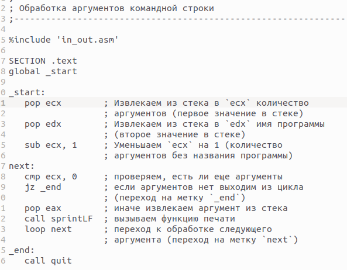

Создадим исполняемый файл и запустим его, указав аргументы:

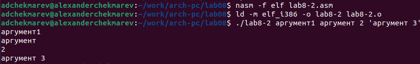

**Сколько аргументов было обработано программой?**

Всего было обработано 4 аргумента, так как "аргумент" и "2" не взяты в одинарные кавычки, в отличии от 4-го аргумента

Рассмотрим еще один пример программы которая выводит сумму чисел, которые передаются в программу как аргументы. 
Создадим файл *lab8-3.asm* в каталоге ~/work/arch-pc/lab08 и введем в него текст программы из листинга 8.3.

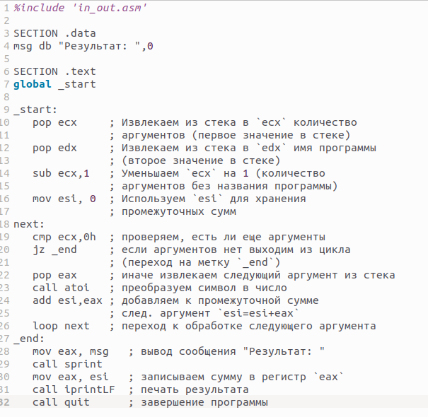

Создадим исполняемый файл и запустим его, указав аргументы.

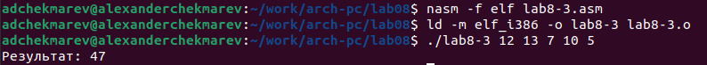

Изменим текст программы из листинга 8.3 для вычисления произведения аргументов командной строки.

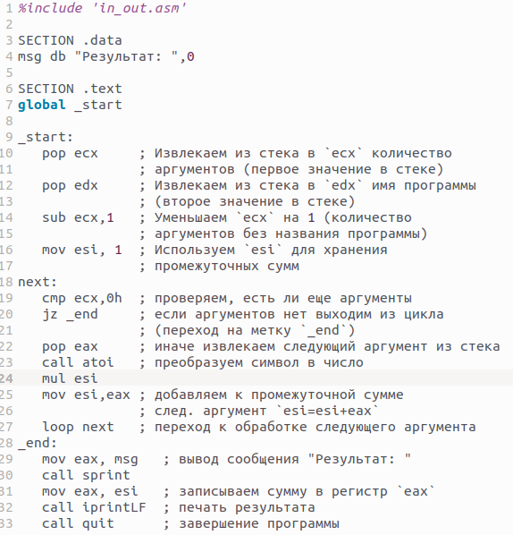

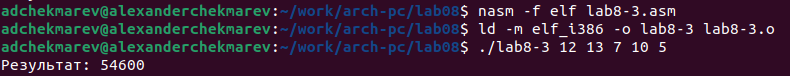

# Самостоятельная работа

***Задание№1 Напишите программу, которая находит сумму значений функции f(x) для x = x1, x2, ..., xn, т.е. программа должна выводить значение f(x1) + f(x2) + ... + f(xn). Значения xi передаются как аргументы. Вид функции f(x) выбрать из таблицы 8.1 вариантов заданий в соответствии с вариантом, полученным при выполнении лабораторной работы № 7. Создайте исполняемый файл и проверьте его работу на нескольких наборах x = x1, x2, ..., xn.***

Создадим новый файл *task1.asm* и напишем программу нахождения суммы значения функции f(x) для варианта 4 (2(x-1)).
 

Возьмем за основу код из *lab8-3.asm* и переделаем его

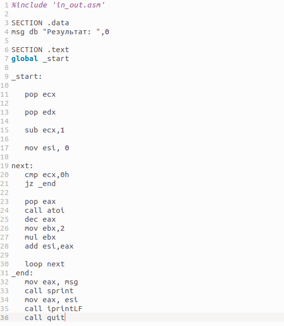

Проверим программу с несколькими значениями x

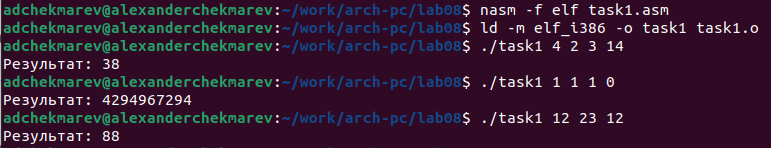

Программа работает корректно

Загрузим все файлы на github по окончании лаб. работы

# Выводы

Я приобрел навыки написания программ с использованием циклов и обработкой аргументов командной строки.

