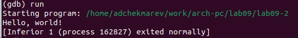

---
## Front matter
title: "Лабораторная работа №9"
subtitle: "Понятие подпрограммы. Отладчик GDB."
author: "Чекмарев Александр Дмитриевич | группа: НПИбд 02-23"

## Generic otions
lang: ru-RU
toc-title: "Содержание"

## Bibliography
bibliography: bib/cite.bib
csl: pandoc/csl/gost-r-7-0-5-2008-numeric.csl

## Pdf output format
toc: true # Table of contents
toc-depth: 2
lof: true # List of figures
lot: true # List of tables
fontsize: 12pt
linestretch: 1.5
papersize: a4
documentclass: scrreprt
## I18n polyglossia
polyglossia-lang:
  name: russian
  options:
	- spelling=modern
	- babelshorthands=true
polyglossia-otherlangs:
  name: english
## I18n babel
babel-lang: russian
babel-otherlangs: english
## Fonts
mainfont: PT Serif
romanfont: PT Serif
sansfont: PT Sans
monofont: PT Mono
mainfontoptions: Ligatures=TeX
romanfontoptions: Ligatures=TeX
sansfontoptions: Ligatures=TeX,Scale=MatchLowercase
monofontoptions: Scale=MatchLowercase,Scale=0.9
## Biblatex
biblatex: true
biblio-style: "gost-numeric"
biblatexoptions:
  - parentracker=true
  - backend=biber
  - hyperref=auto
  - language=auto
  - autolang=other*
  - citestyle=gost-numeric
## Pandoc-crossref LaTeX customization
figureTitle: "Рис."
tableTitle: "Таблица"
listingTitle: "Листинг"
lofTitle: "Список иллюстраций"
lotTitle: "Список таблиц"
lolTitle: "Листинги"
## Misc options
indent: true
header-includes:
  - \usepackage{indentfirst}
  - \usepackage{float} # keep figures where there are in the text
  - \floatplacement{figure}{H} # keep figures where there are in the text
---

# Цель работы

Приобретение навыков написания программ с использованием подпрограмм. Знакомство с методами отладки при помощи GDB и его основными возможностями

# Выполнение лабораторной работы

## Реализация подпрограмм в NASM

Создадим каталог для программам лабораторной работы № 9, перейдем в него и создадим файл *lab9-1.asm*:

В качестве примера рассмотрим программу вычисления арифметического выражения f(x) = 2x + 7 с помощью подпрограммы *_calcul*. В данном примере x вводится с клавиатуры, а само выражение вычисляется в подпрограмме. Внимательно изучим текст программы (Листинг 9.1).

Введем в файл *lab9-1.asm* текст программы из листинга 9.1.

Создадим исполняемый файл и проверим его. Результат работы данной программы будет следующим:

Изменим текст программы, добавив подпрограмму *_subcalcul* в подпрограмму *_calcul*, для вычисления выражения f(g(x)), где x вводится с клавиатуры, f(x) = 2x + 7, g(x) = 3x − 1. Т.е. x передается в подпрограмму *_calcul* из нее в подпрограмму *_subcalcul*, где вычисляется выражение g(x), результат возвращается в *_calcul* и вычисляется выражение f(g(x)). Результат возвращается в основную программу для вывода результата на экран.

Создадим исполняемый файл и проверим его работу.

## Отладка программам с помощью GDB

Создадим файл *lab9-2.asm* в каталоге ~/work/arch-pc/lab09 и введем в него текст программы из листинга 9.2. (Программа печати сообщения Hello world!):

Получаем исполняемый файл. Для работы с GDB в исполняемый файл необходимо добавить отладочную информацию, для этого трансляцию программ необходимо проводить с ключом ‘-g’

Загрузим исполняемый файл в отладчик gdb:

Проверим работу программы, запустив ее в оболочке GDB с помощью команды run (сокращённо r):

Для более подробного анализа программы установим брейкпоинт на метку _start, с которой начинается выполнение любой ассемблерной программы, и запустим её

Посмотрим дисассимилированный код программы с помощью команды disassemble начиная с метки _start

Переключимся на отображение команд с Intel’овским синтаксисом, введя команду set disassembly-flavor intel

**Перечислите различия отображения синтаксиса машинных команд в режимах ATT и Intel.**

Имена регистров в ATT начинается с "%", а в Intel используется более привычный нам синтаксис.

Включим режим псевдографики для более удобного анализа программы (рис. 9.2):

## Добавление точек останова

Установить точку останова можно командой break (кратко b). Типичный аргумент этой команды — место установки. Его можно задать или как номер строки программы (имеет смысл, если есть исходный файл, а программа компилировалась с информацией об отладке), или как имя метки, или как адрес. Чтобы не было путаницы с номерами, перед адресом ставится «звёздочка»:
На предыдущих шагах была установлена точка останова по имени метки (_start). Проверим это с помощью команды info breakpoints (кратко i b):

Установим еще одну точку останова по адресу инструкции. Адрес инструкции можно увидеть в средней части экрана в левом столбце соответствующей инструкции (см. рис. 9.3).
Определим адрес предпоследней инструкции (mov ebx,0x0) и установим точку останова

## Работа с данными программы в GDB

Отладчик может показывать содержимое ячеек памяти и регистров, а при необходимости позволяет вручную изменять значения регистров и переменных.

Выполним 5 инструкций с помощью команды stepi (или si) и проследим за изменением значений регистров. Изменились значения регистров eax, ecx, edx и ebx.

Посмотрим содержимое регистров также можно с помощью команды info registers (или i r).

Для отображения содержимого памяти можно использовать команду x <адрес>, которая выдаёт содержимое ячейки памяти по указанному адресу. Формат, в котором выводятся данные, можно задать после имени команды через косую черту: x/NFU <адрес>.
С помощью команды x &<имя переменной> также можно посмотреть содержимое переменной.
Посмотрим значение переменной msg1 по имени

Посмотрим значение переменной msg2 по адресу. Адрес переменной можно определить по дизассемблированной инструкции. Посмотрим инструкцию mov ecx,msg2 которая записывает в регистр ecx адрес перемененной msg2

Изменим значение для регистра или ячейки памяти можно с помощью команды set, задав ей в качестве аргумента имя регистра или адрес. При этом перед именем регистра ставится префикс $, а перед адресом нужно указать в фигурных скобках тип данных (размер сохраняемого значения; в качестве типа данных можно использовать типы языка Си).
Изменим первый символ переменной msg1

Заменим любой символ во второй переменной msg2.

Чтобы посмотреть значения регистров используется команда print /F <val> (перед именем регистра обязательно ставится префикс $).
Выведем в различных форматах (в шестнадцатеричном формате, в двоичном формате и в символьном виде) значение регистра edx.

С помощью команды set изменим значение регистра ebx:

**Объясните разницу вывода команд p/s $ebx.**

В первом случае мы переводим символ в его строковый вид, а во втором случае число в строковом виде не изменяется

Завершим выполнение программы с помощью команды continue (сокращенно c) или stepi (сокращенно si) и выйдем из GDB с помощью команды quit (сокращенно q)

## Обработка аргументов командной строки в GDB

Скопируем файл lab8-2.asm, созданный при выполнении лабораторной работы №8, с программой выводящей на экран аргументы командной строки (Листинг 8.2) в файл с именем lab09-3.asm:

Создадим исполняемый файл.

Для загрузки в gdb программы с аргументами необходимо использовать ключ --args.
Загрузим исполняемый файл в отладчик, указав аргументы:

Как отмечалось в предыдущей лабораторной работе, при запуске программы аргументы командной строки загружаются в стек. Исследуем расположение аргументов командной строки в стеке после запуска программы с помощью gdb.
Для начала установим точку останова перед первой инструкцией в программе и запустим
ее.

Адрес вершины стека храниться в регистре esp и по этому адресу располагается число равное количеству аргументов командной строки (включая имя программы):

Как видно, число аргументов равно 5 – это имя программы lab09-3 и непосредственно аргументы: аргумент1, аргумент, 2 и 'аргумент 3'.

Посмотрим остальные позиции стека – по адесу [esp+4] располагается адрес в памяти где находиться имя программы, по адесу [esp+8] храниться адрес первого аргумента, по аресу [esp+12] – второго и т.д.

**Объясните, почему шаг изменения адреса равен 4 ([esp+4], [esp+8], [esp+12] и т.д.).**

Шаг изменения адреса равен 4, так как количество аргументов командной строки равно 4.

# Самостоятельная работа

***Задание№1 Преобразуйте программу из лабораторной работы №8 (Задание №1 для самостоятельной работы), реализовав вычисление значения функции f(x) как подпрограмму.***

Скопируем файл *task1.asm* и переместим его в /lab09. Преобразуем этот файл для подпрограммы.
 

Создадим испол. файл и проверим программу с несколькими значениями x

Программа работает корректно

***Задание№2 В листинге 9.3 приведена программа вычисления выражения (3 + 2) * 4 + 5. При запуске данная программа дает неверный результат. Проверьте это. С помощью отладчика GDB, анализируя изменения значений регистров, определите ошибку и исправьте ее.***

Создадим новый файл *task2.asm*

Напишем программу из Листинга 9.3

Проверим программу для выявления ошибки

Правильный ответ 25, в нашем же случае выводится неправильный ответ 10

Получим исполняемый файл для работы с GDB. 

Запустим его и проставим брейкпоинты для каждой инструкции, связанной с вычислениями. 
С помощью команды continue продемся по каждому брейкпоинту, следя за значениями в регистре

Ошибка была найдена. Исправляем её, добавляя после add ebx,eax mov eax,ebx и заменяя ebx на
eax в инструкциях add ebx,5 и mov edi,ebx

Убедимся, что ошибка исправлена

# Выводы

Я приобрел навыки написания программ с использованием подпрограмм. Познакомился с методами отладки при помощи GDB и его основными возможностями.

