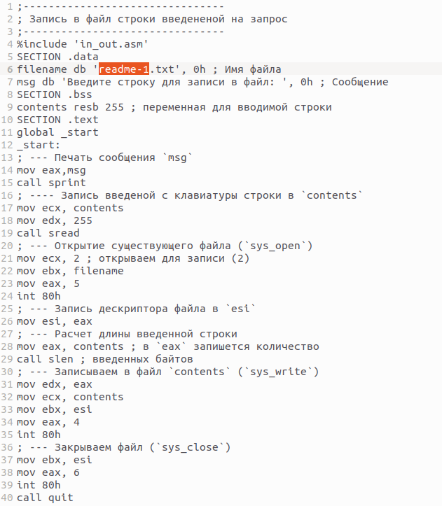

---
## Front matter
title: "Лабораторная работа №10"
subtitle: "Работа с файлами средствами Nasm"
author: "Чекмарев Александр Дмитриевич | группа: НПИбд 02-23"

## Generic otions
lang: ru-RU
toc-title: "Содержание"

## Bibliography
bibliography: bib/cite.bib
csl: pandoc/csl/gost-r-7-0-5-2008-numeric.csl

## Pdf output format
toc: true # Table of contents
toc-depth: 2
lof: true # List of figures
lot: true # List of tables
fontsize: 12pt
linestretch: 1.5
papersize: a4
documentclass: scrreprt
## I18n polyglossia
polyglossia-lang:
  name: russian
  options:
	- spelling=modern
	- babelshorthands=true
polyglossia-otherlangs:
  name: english
## I18n babel
babel-lang: russian
babel-otherlangs: english
## Fonts
mainfont: PT Serif
romanfont: PT Serif
sansfont: PT Sans
monofont: PT Mono
mainfontoptions: Ligatures=TeX
romanfontoptions: Ligatures=TeX
sansfontoptions: Ligatures=TeX,Scale=MatchLowercase
monofontoptions: Scale=MatchLowercase,Scale=0.9
## Biblatex
biblatex: true
biblio-style: "gost-numeric"
biblatexoptions:
  - parentracker=true
  - backend=biber
  - hyperref=auto
  - language=auto
  - autolang=other*
  - citestyle=gost-numeric
## Pandoc-crossref LaTeX customization
figureTitle: "Рис."
tableTitle: "Таблица"
listingTitle: "Листинг"
lofTitle: "Список иллюстраций"
lotTitle: "Список таблиц"
lolTitle: "Листинги"
## Misc options
indent: true
header-includes:
  - \usepackage{indentfirst}
  - \usepackage{float} # keep figures where there are in the text
  - \floatplacement{figure}{H} # keep figures where there are in the text
---

# Цель работы

Приобретение навыков написания программ для работы с файлами.

# Выполнение лабораторной работы

Создадим каталог для программ лабораторной работы № 10, перейдем в него и создадим файл *lab10-1.asm*, *readme-1.txt* и *readme-2.txt*:

Введем в файл *lab10-1.asm* текст программы из листинга 10.1 (Программа записи в файл сообщения)

Создадим исполняемый файл и проверим его.

С помощью команды chmod изменим права доступа к исполняемому файлу lab10-1, запретив его выполнение. Попытаемся выполнить файл.

Когда мы пытаемся выполнить файл нам отказывают в доступе, так как командой *chomod u-x lab10-1* мы запретили его выполнение для владельца

С помощью команды chmod изменим права доступа к файлу *lab10-1.asm* с исходным текстом программы, добавив права на исполнение. Попытайтаемся выполнить его.

Когда мы пытаемся исполнить этот файл исполнение начинается, но не исполняется, так как не содержит в себе команд для терминала

В соответствии с вариантом 4 в таблице 10.4 предоставим права доступа к файлу *readme-1.txt* представленные в символьном виде, а для файла *readme-2.txt* – в двоичном виде. Проверим правильность выполнения с помощью команды *ls -l*

Права доступа были предоставлены правильно.

# Самостоятельная работа

Задание№1 Напишите программу работающую по следующему алгоритму:

• Вывод приглашения “Как Вас зовут?”
• ввести с клавиатуры свои фамилию и имя
• создать файл с именем name.txt
• записать в файл сообщение “Меня зовут”
• дописать в файл строку введенную с клавиатуры
• закрыть файлм

Создать исполняемый файл и проверить его работу. Проверить наличие файла и его
содержимое с помощью команд ls и cat.

За основу возьмем файл *lab10-1.asm*, скопируем его, переименуем в *task1* и напишем программу под условие задания
Но перед этим создадим файл *name.txt*

Создадим испол. файл и проверим программу 

Программа работает корректно.
Проверим наличие файла и его содержимое с помощью команд ls и cat.

Как мы видим, программа теперь точно работает как нужно

По окончании лаб. работы загрузим все файлы на github.

# Выводы

Я приобрел навыки написания программ для работы с файлами.

